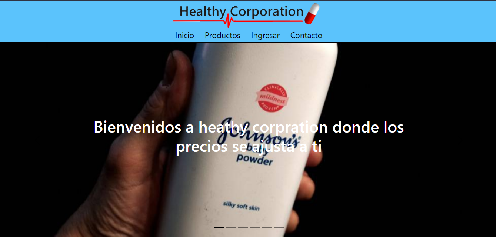

instalar dependencias
instalar sweetalert 

    -npm install @mui/material @emotion/react @emotion/styled
    -npm install @mui/material @mui/styled-engine-sc styled-components
    -npm install @mui/icons-material @mui/material @emotion/styled @emotion/react

    -npm i emailjs-com
    
    -npm install sweetalert2

    -npm i react-image-magnify 

    -npm install react-icons --force

    Para hacer el filtrado por categoria.
        https://www.youtube.com/watch?v=JY7eV4VMeV0 
        https://www.youtube.com/watch?v=3_sj5tfs05g
        https://www.youtube.com/watch?v=gPH7sCyXFb4

        mejor https://www.youtube.com/watch?v=94CVSF0Gr-w